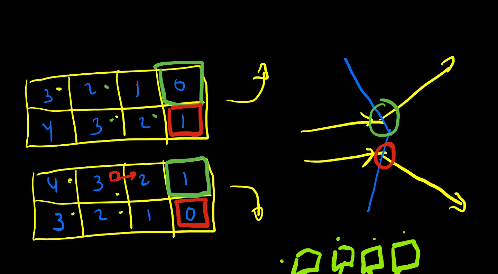
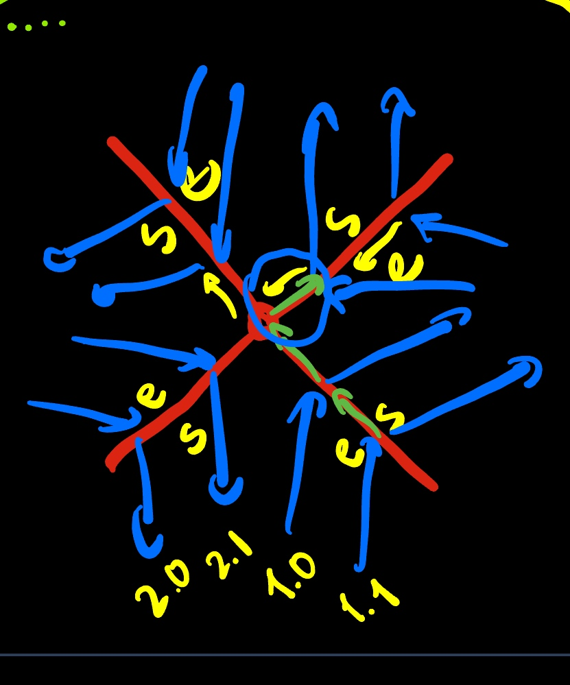
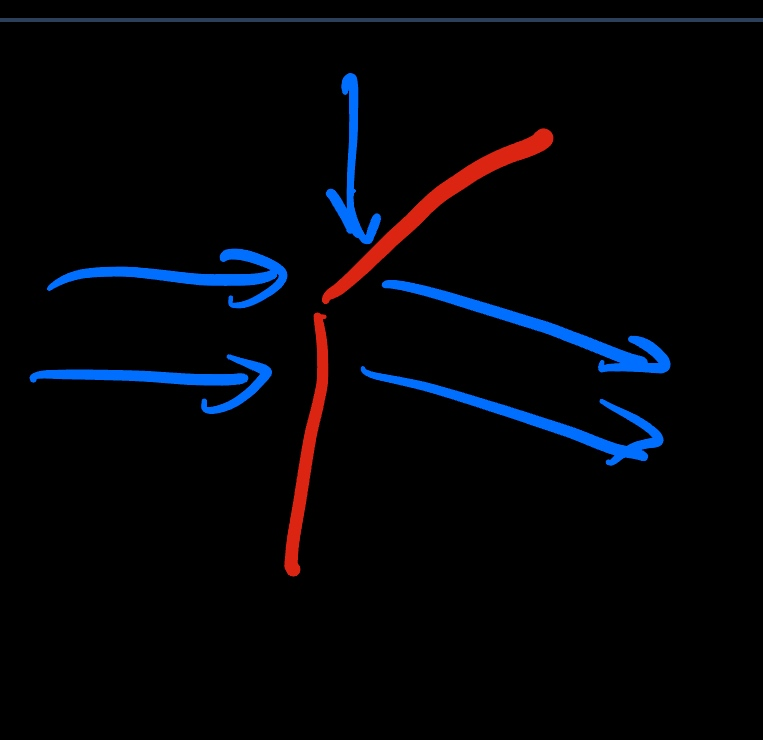
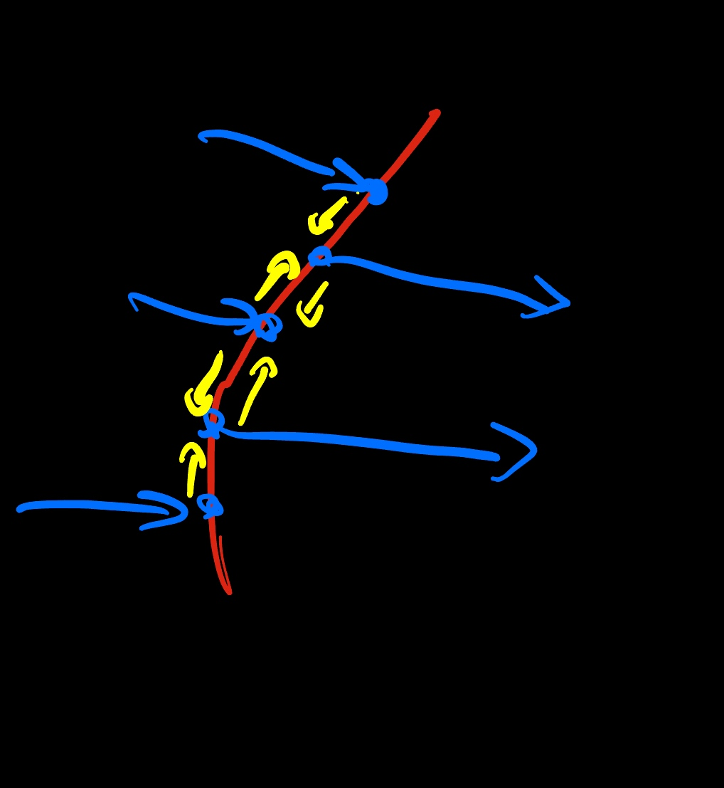
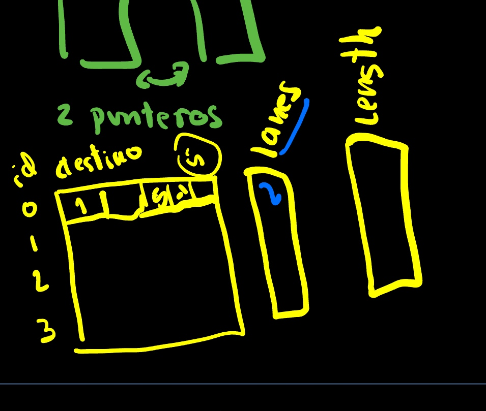

# Previo 13/01/2025

Dado un lane graph y una arista con una bifurcación.
La estructura de datos actual contempla bifurcación de carriles.
Por ejemplo una arista que termina en un nodo con dos salidas puede ser representada de esta forma:

Donde el se carga sobre el carril una preferencias según se desee bifurcar arriba o abajo.
El vehículo escogerá siempre el movimiento a una celda menor cuando esté libre.

Un caso complejo es el siguiente, un cruce de dos avenidas:

En el que en cada flex (rojo) hay entradas y salidas, entradas por un lado, salidas por otro lado.

La ide del teletrasportador es que si alguien requiere realizar el movimiento verde, solicite bloquear los nodos del camino.

El ejemplo más común es el siguiente:

Donde en una avenida se incorpora un carril.

Buscando una binarización, o simplificación se puede adaptar el código a la siguiente estructura:

En la que no se hacen coincidir las entradas y salidas, se intercalan. En dicho caso, si bien no es el ideal de Fernando, se puede encontrar un nodo con 2 entradas y 2 salidas que Fernendo debiera tratar.

Se informa de la estructura final:

Fernando suministra:
* ejemplo binarizacion multicarril y casos cambio carril.pdf Apuntes manuscritos
* structs that define graph model of lanes.docx Implementación con estructura de datos.